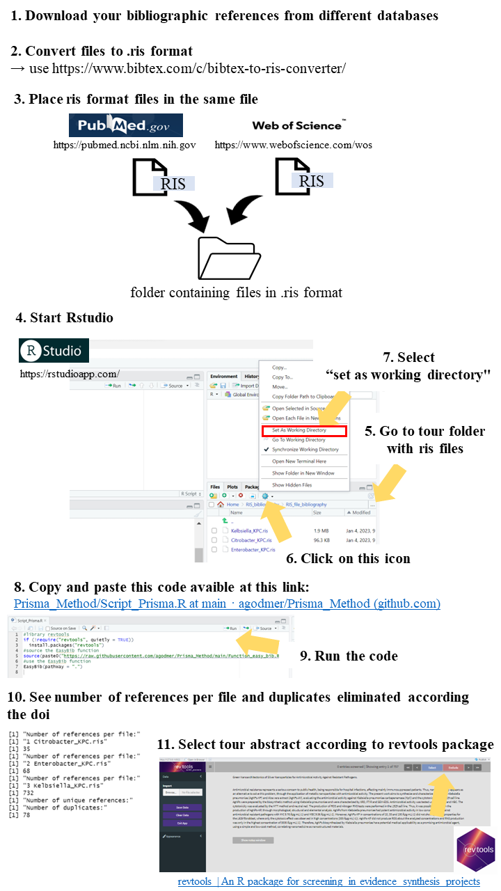

# Prisma Method

This tutorial will help to do a literature review using the Prisma method with the R function `EasyBib` and the R package revtools. The `EasyBib` function allows you to observe the number of references among several bibliographic files (in .ris format) and to eliminate duplicates. Abstracts can be viewed for selection or exclusion with the `screen_abstracts` function of the `revtools` package directly included in the `EasyBib` function. Below are some tools and information :

## 1. Guidelines
See [guidelines](https://guides.lib.unc.edu/systematic-reviews/write)

## 2. Convert files in RIS fromat
See easy steps to convert files in RIS fromat : [bibtext](https://www.bibtex.com/c/bibtex-to-ris-converter/)

## 3. Bibliography analysis with the `revtools` package
- Place all .ris files in  a folder (called RIS_files for this example with 3 .ris files at this [link](https://github.com/agodmer/Prisma_Method/tree/main/RIS_files))
- Execute `EasyBib` function with the `pathWay` argument corresponding to the path to the folder containing the ris files with the following code:
```
#library revtools
if (!require("revtools", quietly = TRUE))
            install.packages("revtools")
#source the EasyBib function
source(paste0("https://raw.githubusercontent.com/agodmer/Prisma_Method/main/Function_easy_bib.R"))
#use the EasyBib function 
EasyBib(pathWay = "~/RIS_files")
```
# 4. Tutorial
<p align="center">
  
</p>

# 5. References 
[1] Westgate MJ (2019). “revtools: An R package to support article screening for evidence synthesis.” Research Synthesis Methods. doi:10.1002/jrsm.1374.  
[2] [bibtext](https://www.bibtex.com/c/bibtex-to-ris-converter/)
